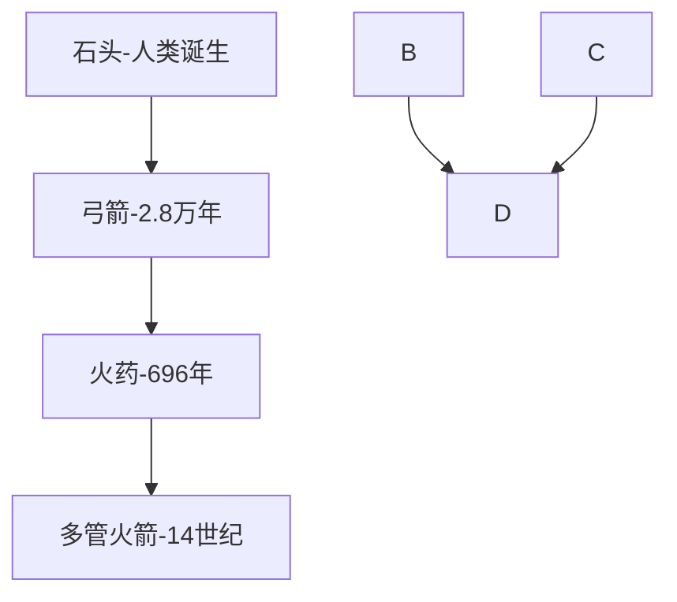

#  
***
## 序言
&emsp;&emsp;这些年，写了无数同一风格的八股文报告，把各种弹药、武器平台的发展历史、发展趋势写了个遍，同时也论证了无数的弹药方案，但静下心来仔细想想，我们真的了解它的历史、摸清了它的发展规律、真的能指导我们做下一个项目的策划吗？诚然，我们也会根据国内外发展的情况总结综述，得出我们看似正确的结论，但往往我们只不过是在描述和总结它的发展现象，并未弄清它的发展内在逻辑。写这篇文章，是为了跳出这个固定的思维方式，抛开具体的技术细节，从一种新的角度，把弹药、武器当作科技体[1]的一种，研究它所固有的特点及进化的规律。  

&emsp;&emsp;哈工大2000年左右的《导弹总体设计原理》中，其中有这样的一个章节“导弹走向军转民的应用”写道，（其实这段放在现行的教材里面确实挺有现实意义）：
  > 导弹是一种现代化的武器，但就像原子弹能和平利用一样，导弹”军转民“的应用范围也十分广阔，能够创造许多奇迹。举例如下：
  > 1. 空中冶炼:80年代末，地球上第一枚“炼钢导弹”在日本发射成功。该导弹舱中装有两台电炉，电炉内盛有钛、碲、钼、镍等多种元素材料。导弹发射至高空后，冶炼过程开始...。这种用导弹冶炼的合金，其强度比地面冶炼的要高2.5倍，硬度高1.85~1.9倍。
  > 2. 导弹钻探：依靠火箭发射时喷出的高温火焰射流向地层深处“钻探”。这种高温火焰射流面前就连最硬的花岗岩也变得柔软如泥。其速度之快，质量之好令人刮目相看。
  > 3. 导弹邮递：90年代初，英国人试验了“导弹邮递”。此法只需将导弹的弹头舱改为存放邮包就行了。当导弹飞到目的地时，“导弹邮包”便借助降落伞漂下回收。利用导弹进行快递邮寄，不仅应用前景十分广阔，而且在竞争激烈的当今世界，将发挥及其重要的作用。
  > 4. 导弹电视：.....

&emsp;&emsp;这四点预测哪一种放在今天看都难说准确，或者说是不能再扯淡点了。为何我们会有如此糟糕的预测，或许我们太局限于技术而难以跳出技术。*导弹/弹药，它不是一个技术，而是技术集合的一个实体。导弹邮递的想法，我想真的比较符合目前“东风快递”，可惜人家送的确实是真的弹头*

&emsp;&emsp;想借鉴凯文凯利的思想，对武器、弹药的内在发展规律进行阐述。他在《科技要什么》中描述科技为第七界生命（地球上发现的生物种类可以分为六大类，而在这六大类或说六大生物界之中，所有的物种都有着共同的生化结构），科技体的进化递增次序的轨迹与生命所遵循的轨迹相同，但也与生物界之间有重大的差异：
  > 1. 科技体就等于功能变异，因为创新可以被轻易的从原点借走，或者跨越时间被赋予新的途径;
  > 2. 科技体能够向前跳跃，略过慢慢增加的步骤，出现突然的急速进步;
  > 3. 科技物种不像生物物种，它们几乎永远不会灭绝；

&emsp;&emsp;在过去的那些年，我们在这个领域内飞速的发展，我想这是一个必然的过程，科技体能够向前跳跃式的发展，略过慢慢增加的步骤，出现突然急速进步，这也就是某党一直说的“用二十年的时间发展赶上了西方百年的积淀”。

如果从这些宏观的角度出发，我们进行研究，我们基本上能得出一个大范围时间内的发展的大致趋势，同时我们也能够很好的解释在过去这些年的发展、跃进、得与失。

[1]:
***

&emsp;&emsp;很多的时候，我们是否应该反思下我们自己的策略，
任何事物都是在进化,宇宙、生命、道德、文化、技术无一例外，没有永远一成不变的事物，哪怕它是化石。

* 写作的目的，揭示科技体的物种之一。。的内在发展规律和特点，

## 第一章 弹药极简进化史
> 人类制度、人工制品和习惯的改变，都是渐进的、必然的、不可抵挡的。

弹药是通过能量/信息的转移至目标的装置，造成目标死亡/消亡或无法正常工作。传统的如火箭弹、炮弹、导弹直至定向能武器、网络攻击我想都应该包含在上面这个定义里。首先我们来讨论下弹药进化的方向。

### 1 弹药进化方向
达尔文说，眼睛的演变是因为，在过去，能提供一点视力的简单眼睛为拥有者带来了生存的优势，帮助他们进行繁殖，而不是因为某人故意要获得视力。我们所有用来描述功能的说法，都采用自上而下的视角。眼睛是“为了看”，有了眼睛的存在，我们“才能”看，看之于眼睛，就如同打字之于键盘。

以达尔文的观点来解释弹药的发展我也认为非常正确，我们不是为了获得某种特性的弹药而进行发展，而是因为拥有某种特性会帮助它在战争的竞争过程中取得优势。而以竞争为基础的，其必然是一个渐进演化的过程,下面我们可以来看看它发展的这一过程，而对于保证这一演化的竞争优势，主要的涵盖在这样的几个方面（射程、精度、威力/火力）。

> 1. 上百万年前，从人类诞生的开始，原始人类通过投掷石头、木棍等进行狩猎、战争，这是区别于动物采用身体肉搏的一项重要技能，具有一定的划时代意义,而投掷的石头和木棍等可以作为最原始的弹药一种；

> 2. 2.8万年前，为提升竞争优势，采用外力对弹药进行投掷，而发展最为成功的即弓箭，增加了射程。为进一步提升在竞争中的优势地位，在漫长的进化过程中逐步从把石头、木头演变成各种形状各异的金属箭头，提升威力；同时不断的对弓箭进行改良，进一步的提成射程和精度。

> 3. 时间一直持续到900年前，为进一步的提高弹药射程，取得在战场上的竞争又是，火药技术引入至弹药领域，发明了中国火箭。为提升火力，形成了多管火箭筒，（这与现代火箭弹的发展又何其的相似）；为提高精度，形成了火炮、带膛线的炮，让热兵器的厮杀不再靠人品。
> 4. 再推至六七十年前，随着对射程及精度更高的需求，发动机技术、制导控制技术引入弹药，使得射程及精度的进一步的提升。 

从上面可以看出，每一次弹药性能的提升，虽然都是技术上进行更新的结果，但却是由于竞争需求的牵引，让技术不断进行横向至纵向的迭代更新。
从人类战争史上，我们可以得出这样简单粗暴的结论，弹药/武器的代差意味着屠杀，这一点上无论是哥伦布时代的印第安人、还是近现代的中国人应该最有体会。所以世界上那些超级大国所制定的战略目标是谋求领先敌对/假想敌一代，使得在竞争中始终占有先机。所以我们不光是紧紧盯着技术的发展，而更应该考虑到现实领先的竞争需求，生存竞争的需求。**制对手即弹药的进化方向。**

[]参考《导弹概论》

* 技术的发展是一个不可逆的过程。

参考兵器系列：火炮
口径即整理
> 弩炮,主要向要塞投射石头
> 加农炮

膛线——让热兵器的厮杀不再靠人品，

除非你速度达到7.9km/s 否则你想脱离地球遥遥无期。

### 2 各部分渐进独立进化

技术的发展有其必经的路径，当单一技术条件成熟时，并不能保证其真正的应用，事实上，也很少有来得太早的技术，他们总是出现的最合情合理的那个历史瞬间。
从石器时代到如今，地球上的每一个角落，技术的故事都是这样：不管你考察什么地方，技术都庄严的从一种工具进入下一种，很少蹦蹦哒哒，也很少偏离主线，对这种路径的依赖非常明显。除非你发明了钢铁、水泥、电力和运算，理解核物理，否则开采铀矿遥遥无期。

从粗略的技术层面来分析，弹药分为发射及推进、毁伤、结构及制导等多个部分，从其发展演变规律来看，由于各个部分的发展塑造了导弹，而不是导弹的发展引领了各部分的发展：
|发射及推进方式|机械能|化学能|电磁能|
|--------|---|----|----|
|典型代表产品|
|结构|
|毁伤|
|制导|
- [ ] 发射推进方式的发展进化，指标---
* 人工投掷
按照国际田联的标准，男子标枪800克，投掷的世界记录，104米。石头投掷的距离与标枪基本差不多。而在实际的战场，不管是投掷石头、标枪、手榴弹，最大的有效射程不会超过50m，这个射程已经属于人类投掷的极限，就算再怎么永无止境的运动精神鼓舞想达到200m或更远这是绝无可能。其中这主要受到人投掷时所能赋予被投掷物体的动能限制。
* 古代弓箭射击
中国宋代以来的弓种情况看，弓的最大射程一般在200米左右，有效射程在120米以内。也就是说，双方真正展开战斗队形后进行弓箭的有效交火，是在相距100米这个距离上。然后说单兵弩，单兵弩的各种数据记载虽然很大，但是实战当中一般都是平射使用，以目前的器物遗存以及图画材料看，很难证实实际当中能达到什么三百步，五百步的最大射程，最多在一百步一百五六十米的距离上实现精度射击就很不错了。
中国早已经有最大射程和有效射程的概念，以宋代已降的弓种情况看，弓的最大射程一般在200米左右，有效射程在120米以内。也就是说，双方真正展开战斗队形后进行弓箭的有效交火，是在相距100米这个距离上。
同样，采用弓箭射击受到的限制与人工投掷一样，投掷物体的动能受限制，而其取决于弓的拉力、行程还有弓的效率。射程较远的土耳其弓箭（flight bow）,实际测量的设计距离为820m。　　

* 火药发射
火药发射始于9世纪的中国火箭，到12世纪火箭射程320m，弹头黑火药。
十五世纪，朝鲜“神机箭”，射程457m，弹头箭头和黑火药，200支火药推动的箭。
* 采用火箭发动机技术，射程、重量、威力；

- [ ] 结构发展---

- [ ] 毁伤方式---
* 采用动能毁伤；

* 采用化学能毁伤；

* 采用核能毁伤；

- [ ] 制导----
* 无控
射击精度受到的约束较多，气动外形、射击速度、出膛的扰动等，这很大程度上取决与使用者的基本素质、加工精度、工艺水平等等；
通过加工工艺、膛线等设计，提升无控精度；
* 简易控制；

* 采用惯性器件，提升制导精度；

* 采用导引器件，进一步提升制导精度。

> 从弓箭 ——> 宋代的火箭筒 ——> 朝鲜的多管火箭筒——>
> V1、V2火箭 ——>
> 参考兵器系列：火箭
> 火箭始于9世纪的中国，12世纪中国火箭，射程320m，弹头黑火药
> 十五世纪，朝鲜“神机箭”，射程457m，弹头箭头和黑火药，200支火药推动的箭
> 射程3.3km，弹头
> 霍尔火箭，射程2.7km

* 需要补充一个随时间变化的射程曲线，包含各中进化的武器。（其中包含精度、威力等描述，求助于python???）

&emsp;&emsp;距今约2.8万年,已经使用弓箭；火药发明后的公元969年，就用火药制成了火箭。至14世纪，为提高火箭杀伤威力，制造了一种多支火箭齐射的火箭束。

**需要补充材料**
- [ ] 各部分独立发展的图

### 3 技术永不消亡，只是以不同的形式存在

***
## 第二章 聆听导弹的声音

> 从性能上说，射程、威力、精度是其永恒的追求，
> 作为一个群体，其如何发挥作用，协同作战能力
> 

~~每一个领导感觉都有自己的想法，联系自己做的事情会想到怎么去改变，~~
>抛开技术细节，来
**复合S曲线**
2005年，纪念摩尔定律40年的时候，摩尔写道：“摩尔定律其实是经济学的定律。”，摩尔定律其实就是人类的信念系统，并非物理学定律，和人类信念相关。事实上重点在于人类的活动、人类的愿景，以及你能够相信的东西。
如果飞行科技体验跟英特尔芯片一样的进步，现代的客机一架只要500美元，20分钟内就能绕地球一圈，而绕一圈只会用5加仑燃料。但飞机可能只有鞋盒大小！

自然进化与人工进化之间最大的差异就是科技物种不像生物的物种，它们几乎永远都不会灭绝。所以我们能看到各种武器，第一代、第二代、第三代共存、公共装备的现状。

***

## 第三章 所谓的顶层设计与规划

>**自然界没有顶层设计，一切源于野蛮生长。 《自下而上——万物进化简史》**

在西方的思想史上，把世界解释为上帝设计和规划的结果。就算整个世界真是上帝设计的，那么我也只相信他设计了规则和原则，而发展、演化的历程只是全由它自生自灭。就如宇宙大爆炸带来的无尽混乱与折腾，最终落入宇宙如今所展示出来的形式。

是生命适应了物理定律，而不是反过来，让物理定律去适应生命。

* 很多人认为，这些年这么快速的进步，得益于我们国家在整体上的策划、高瞻远瞩，

各个部分是独立发展的，而不是有一条主线进行牵引。。。

一直在想，作为总体设计，应该怎样从总体上去优化分系统，却发现确实是非常难得一件事情。计算机计算许多数的乘法应该来说是相当容易的一件事，但是要计算机去分解一个大数也是特别困难的事情，所有要求总体去引领部件发展就如同让你去分解一个大数一样，本身来说就是一件非常非常难得事情。

甚至爆出“中国在研的火箭弹比全世界在研究的项目都多”，爆发式的野蛮发展是我们走向成功产业升级的必由之路。

## 第四章 技术终将趋同

发展过冲：野蛮生长、最终趋同；百花齐放后
* 奥卡姆剃刀原理；
* 对一战、二战整个过程中出现的口径、弹药，再到目前世界口径弹药的格局进行梳理，发现这弹药的竞争如同生物竞争一样，百花齐放后最终归于沉寂。技术终将趋同。

## 第五章 再也回不去的低端市场

> 表达的观点：抛开政治层面，如果时间的维度再放大一点来看待技术，所有的竞争者技术将趋同，拥有成本优势的大量下游企业将竞争占领上游企业当前的领地。
补充“西方钢铁企业的进化历史”

如果我们延续20世纪50年代的有机农业，不大量的使用肥料，就需要地球82%的陆地面积来栽培作物，但我们现在的耕种的土地面积只占38%。
我们不会照现在的样子走下去。面对明天的问题时，我们用的是明天的工具，而不是今天的。这就是所谓的进步。

## 第六章 冲突

**对于领先的企业，更没有必要冒这种风险。谚语说，If it works, don't fix it**！**只有落后者，光脚不怕穿鞋的，反而可以冒这个险。冒险至少还有赢的机会，不冒险就输定了。**

## 第六章 方向
>人类文化的发展，是渐进的、增量的、无预定方向的、自然发生的,并受种种竞争理念自然选择推动。

## 题后记